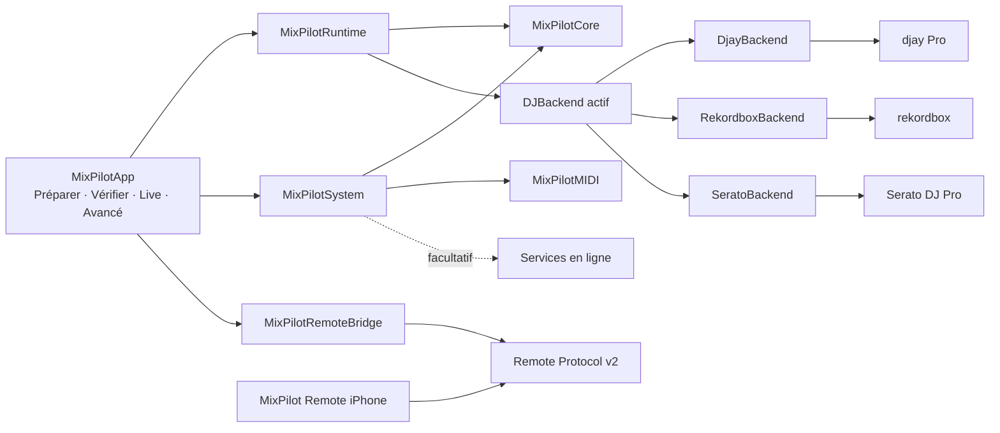

# Architecture MixPilot

Ce document résume l’architecture actuelle. La référence détaillée est :

- `Documentation/MULTI_BACKEND_ARCHITECTURE.md` ;
- `Documentation/BACKEND_CAPABILITY_MATRIX.md`.

## Règles de dépendance

- `MixPilotCore` ne dépend d’aucun logiciel DJ, framework d’interface ou service distant.
- `MixPilotRuntime` reçoit un `DJBackend` et ne connaît pas son implémentation concrète.
- `MixPilotMIDI` envoie des messages déjà autorisés ; il ne décide pas si une commande est sûre.
- `MixPilotSystem` contient les adaptateurs macOS, l’audio, les fichiers et les services en ligne facultatifs.
- `MixPilotRemoteBridge` laisse le Mac accepter ou refuser chaque intention iPhone.
- aucune logique cloud n’entre dans le moteur de transitions ;
- aucune logique iPhone n’entre dans les adaptateurs DJ.

## Contrat commun

Chaque backend :

- détecte son environnement ;
- annonce ses capacités ;
- valide sa configuration ;
- exécute une commande universelle ;
- vérifie séparément l’effet attendu ;
- rend le contrôle manuel.

Une commande envoyée n’est jamais considérée comme réussie sans preuve correspondante.

## Validation

- les tests unitaires valident les contrats et décisions logicielles ;
- les simulations portent `SIMULATED_SUCCESS` ;
- les fonctions dépendant du logiciel ou du matériel conservent `REQUIRES_BACKEND_VALIDATION` ou `REQUIRES_DEVICE_VALIDATION` ;
- une CI verte ne constitue pas une validation matérielle.
