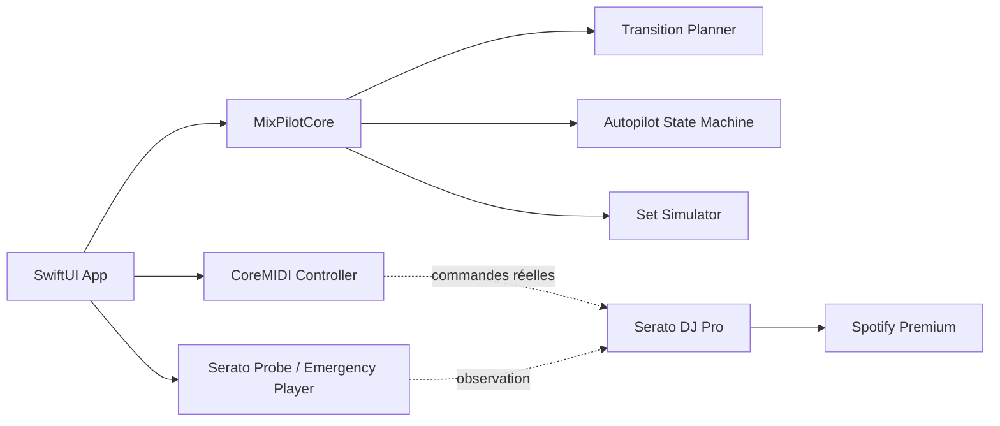

# Architecture du MVP

## Séparation des responsabilités

- `MixPilotCore` est indépendant des frameworks Apple et testable sur Linux/macOS.
- `MixPilotMIDI` crée le port virtuel et émet les messages MIDI.
- `MixPilotSystem` regroupe les interactions macOS, la détection Serato et le secours local.
- `MixPilotApp` fournit l’interface native.
- `MixPilotSimulatorCLI` exécute des sets accélérés en CI.

## Règle de validation

Les résultats du simulateur portent le statut `SIMULATED`. Les fonctions dépendant de Serato ne passent au statut `REAL` qu’après un test sur un Mac réel avec Serato DJ Pro.
